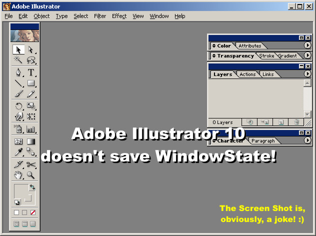

<div align="center">

## Save Form Size, the right way\!


</div>

### Description

Microsoft provided a pretty lame example of saving the Form Size on Registry. This example is on the MSDN Library.

In 20 minutes I was able to write a few lines of code that will save not only the Form Size but also the WindowState!

The WindowState is a commonly forgotten property that should always be saved. A very surprising example of this mistake can be found on Adobe Illustrator 10! When I Maximize Illustrator's window and, then, close the application, it doesn't memorize the WindowState. When I reopen Illustrator, its window fills the entire screen but it is on Normal WindowState. Because of this, the window is always a little bit off the right position. I always end up maximizing the window. Every single time!!

Don't do the same mistake! Just follow the instructions below and you will be home free! :)

----

Update 05/31/02 - 3:22AM! (My wife hates me!!) :)

----

I heard the crowd and made considerable changes on the code. Now it checks the screen size so, in the rare event that the user reduces the resolution of his monitor, the Form will not end up off screen or too big.

I, also, fixed a little bug on the Form Unload event. (What would you expect from a code that took me only 20 minutes to write!!) :)

----

Update 05/31/02 - 11:16AM! (Now, my boss hates me, too!!) :)

----

I just made a few tweaks on the code. I can't help it. I am a perfectionist! :)

The code will, now, use the name of the Form to create the name of the keys that are going to be created on Registry.
 
### More Info
 


<span>             |<span>
---                |---
**Submitted On**   |
**By**             |[Elias Barbosa](https://github.com/Planet-Source-Code/PSCIndex/blob/master/ByAuthor/elias-barbosa.md)
**Level**          |Beginner
**User Rating**    |4.9 (54 globes from 11 users)
**Compatibility**  |VB 6\.0
**Category**       |[Registry](https://github.com/Planet-Source-Code/PSCIndex/blob/master/ByCategory/registry__1-36.md)
**World**          |[Visual Basic](https://github.com/Planet-Source-Code/PSCIndex/blob/master/ByWorld/visual-basic.md)
**Archive File**   |[](https://github.com/Planet-Source-Code/elias-barbosa-save-form-size-the-right-way__1-35296/archive/master.zip)


### Source Code

```
'---------------------------------------
'First, get the size that
'the window is supposed
'to have if it is on
'Normal state and, then,
'set the WindowState.
Private Sub Form_Load()
 Dim intScreenHeight As Integer
 Dim intScreenWidth As Integer
 Dim intMeLeft As Integer
 Dim intMeTop As Integer
 Dim intMeWidth As Integer
 Dim intMeHeight As Integer
 'Get the monitor Width and Height.
 intScreenHeight = Screen.Height
 intScreenWidth = Screen.Width
 'Get the Form dimensions that were
 'previously saved on Registry.
 intMeLeft = GetSetting(App.Title, "Settings", Me.Name & "Left", 100)
 intMeTop = GetSetting(App.Title, "Settings", Me.Name & "Top", 100)
 intMeWidth = GetSetting(App.Title, "Settings", Me.Name & "Width", intScreenWidth / 2)
 intMeHeight = GetSetting(App.Title, "Settings", Me.Name & "Height", intScreenHeight / 2)
 'Check if Form would
 'end up off screen.
 If (intMeTop > intScreenHeight) Then
 Me.Top = 100
 Else
 Me.Top = intMeTop
 End If
 'Check if Form would end
 'up taller than the screen.
 If (intMeHeight > intScreenHeight) Then
 Me.Height = intScreenHeight / 2
 Else
 Me.Height = intMeHeight
 End If
 'Check if Form would
 'end up off screen.
 If (intMeLeft > intScreenWidth) Or (intMeLeft + intMeWidth < 0) Then
 Me.Left = 100
 Else
 Me.Left = intMeLeft
 End If
 'Check if Form would end
 'up wider than the screen.
 If (intMeWidth > intScreenWidth) Then
 Me.Width = intScreenWidth / 2
 Else
 Me.Width = intMeWidth
 End If
 'Now, set the WindowState.
 Me.WindowState = GetSetting(App.Title, "Settings", Me.Name & "WindowState", vbNormal)
End Sub
'---------------------------------------
Private Sub Form_Resize()
 'Only save the window
 'size if it is on Normal
 'WindowState.
 'Check, also, the Visible
 'Property to avoid saving
 'the window size
 'while the Form is
 'loading. This will
 'prevent conflicts.
 If (Me.WindowState = vbNormal) And (Me.Visible) Then
 SaveSetting App.Title, "Settings", Me.Name & "Left", Me.Left
 SaveSetting App.Title, "Settings", Me.Name & "Top", Me.Top
 SaveSetting App.Title, "Settings", Me.Name & "Width", Me.Width
 SaveSetting App.Title, "Settings", Me.Name & "Height", Me.Height
 End If
End Sub
'---------------------------------------
Private Sub Form_Unload(Cancel As Integer)
 'Save WindowState
 'only if the window is
 'not on Minimized state.
 If (Me.WindowState <> vbMinimized) Then
 SaveSetting App.Title, "Settings", Me.Name & "WindowState", Me.WindowState
 End If
 If (Me.WindowState = vbNormal) Then
 'Imagine that the user didn't resize
 'the Form but just moved it and, then,
 'closed it. The new left and top
 'properties would end up not been
 'saved. That's why the following two
 'lines of code are on the Form Resize
 'event and here too.
 SaveSetting App.Title, "Settings", Me.Name & "Left", Me.Left
 SaveSetting App.Title, "Settings", Me.Name & "Top", Me.Top
 End If
End Sub
```

